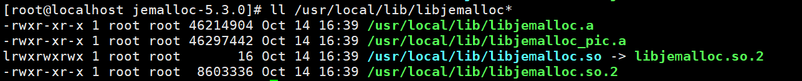

# Best Practices

## System-Level Optimization

Jason Evans malloc (jemalloc) is a high-performance and general-purpose memory allocator. To improve the performance of TensorFlow Serving in high-concurrency inference scenarios, Kunpeng TensorFlow Serving introduces jemalloc to manage memory more efficiently, reduce lock contention and mitigate fragmentation. This leads to a lower variance in memory usage and higher throughput and stability for inference requests.

1. Obtain the jemalloc source archive and decompress it.

    ```bash
    wget https://github.com/jemalloc/jemalloc/archive/refs/tags/5.3.0.tar.gz --no-check-certificate
    tar zxvf 5.3.0.tar.gz
    ```

2. Go to the installation directory.

    ```bash
    cd jemalloc-5.3.0/
    ```

3. Compile and install jemalloc.

    ```bash
    ./autogen.sh
    ./configure
    make -j
    make install
    ```

4. Verify the installation.

    ```bash
    ll /usr/local/lib/libjemalloc*
    ```

    The installation is successful if the following information is displayed:

    

5. You can enable jemalloc by setting the `LD_PRELOAD` environment variable and use the `MALLOC_CONF` environment variable to configure the memory manager's behavior. This document provides the enablement commands and the optimal configurations for the Kunpeng platform.

    ```bash
    export LD_PRELOAD="/usr/local/lib/libjemalloc.so"
    export MALLOC_CONF="background_thread:true,metadata_thp:auto,dirty_decay_ms:20000,muzzy_decay_ms:20000"
    ```

## Integrating KDNN

Kunpeng Deep Neural Network Library (KDNN) is a high-performance AI operator library optimized for the Kunpeng platform. These optimizations are delivered by integrating operators such as MatMul, FusedMatMul, and SparseMatmul into TensorFlow. Integrating KDNN can reduce the latency of Neural Network (NN) operators and greatly improve the model inference performance. This section describes how to integrate KDNN into a benchmark framework.

1. Obtain the [KDNN software package](https://gitcode.com/boostkit/boostsra/releases/download/v1.1.0/BoostKit-boostcore-kdnn_3.0.0.zip) for GCC. Decompress the ZIP file to obtain the RPM installation package.
2. Install KDNN.

    ```bash
    rpm -ivh boostcore-kdnn-3.0.0.1.aarch64.rpm
    ```

    The header file installation directory is `/usr/local/kdnn/include`, and the library file installation directories are `/usr/local/kdnn/lib/threadpool` and `/usr/local/kdnn/lib/omp`.

3. Install KDNN header files and static libraries to the `/path/to/tensorflow/third_party/KDNN` directory.

    ```bash
    export TF_PATH=/path/to/tensorflow
    mkdir -p $TF_PATH/third_party/KDNN/src
    cp -r /usr/local/kdnn/include $TF_PATH/third_party/KDNN
    cp -r /usr/local/kdnn/lib/threadpool/libkdnn.a $TF_PATH/third_party/KDNN/src
    ```

4. Go to the KDNN directory and apply the header file patch to fix TensorFlow's exception handling limitation.

    ```bash
    cd $TF_PATH/third_party/KDNN
    patch -p0 < $TF_PATH/third_party/KDNN/tensorflow_kdnn_include_adapter.patch
    ```

5. Run the build script to compile the code.

    ```bash
    cd /path/to/serving
    sh compile_serving.sh --tensorflow_dir /path/to/tensorflow --features gcc12,kdnn
    ```

6. Verify the integration.
    1. Start the server.

        ```bash
        numactl -N 0 /path/to/serving/bazel-bin/tensorflow_serving/model_servers/tensorflow_model_server --port=8889 --model_name=deepfm --model_base_path=/path/to/model_zoo/models/deepfm --tensorflow_intra_op_parallelism=1 --tensorflow_inter_op_parallelism=-1 --xla_cpu_compilation_enabled=true
        ```

        > **Note:**
        >`numactl -N 0`: binds the program's memory allocation to NUMA node 0.

    2. Start the performance test on the client.

        ```bash
        docker run -it --rm --cpuset-cpus="$(cat /sys/devices/system/node/node0/cpulist)" --cpuset-mems="0" --net host  nvcr.io/nvidia/tritonserver:24.05-py3-sdk perf_analyzer --concurrency-range 28:28:1 -p 8000 -f perf.csv -m deepfm --service-kind tfserving -i grpc --request-distribution poisson -b 128  -u localhost:8889 --percentile 99 --input-data=random
        ```

        > **Note:**
        >--`--cpuset-cpus`: limits the container's processes to execute on the specified CPU cores.
        >--`--cpuset-mems`: specifies the memory node bound to the container.

        After the stress test starts, the server prints "KDNN custom operations are on.You may see slightly different numerical results due to floating-point round-off errors from different computation orders. To turn them off, set the environment variable \`TF_ENABLE_KDNN_OPTS=0\`." In this case, the function is enabled successfully.

        KDNN is enabled by default. You can set the environment variable `TF_ENABLE_KDNN_OPTS` to `0` to disable KDNN.

        
