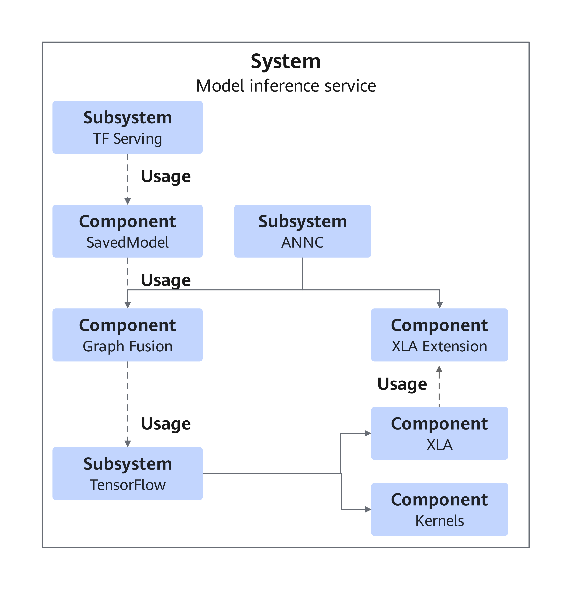
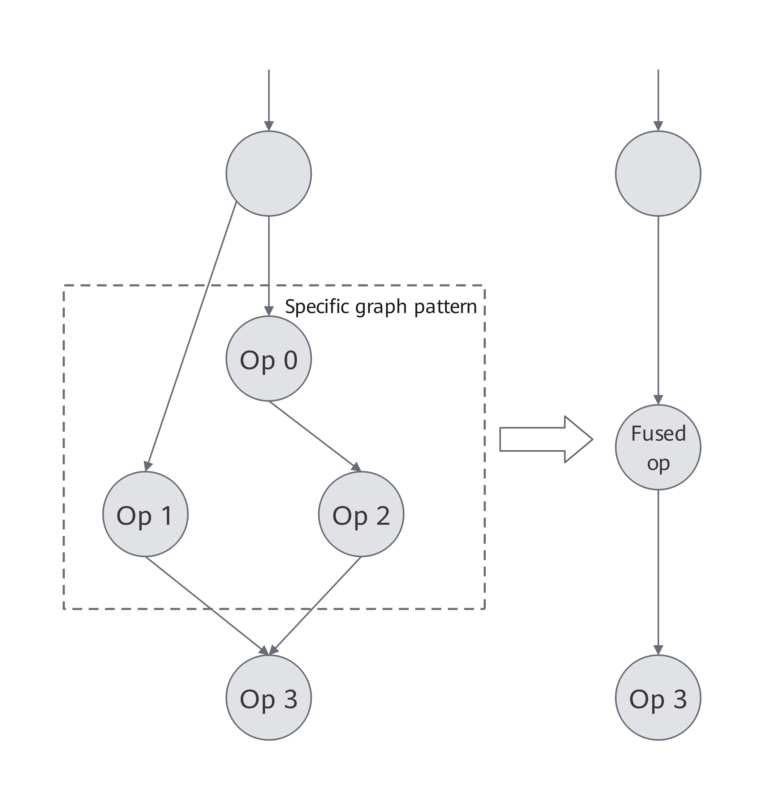
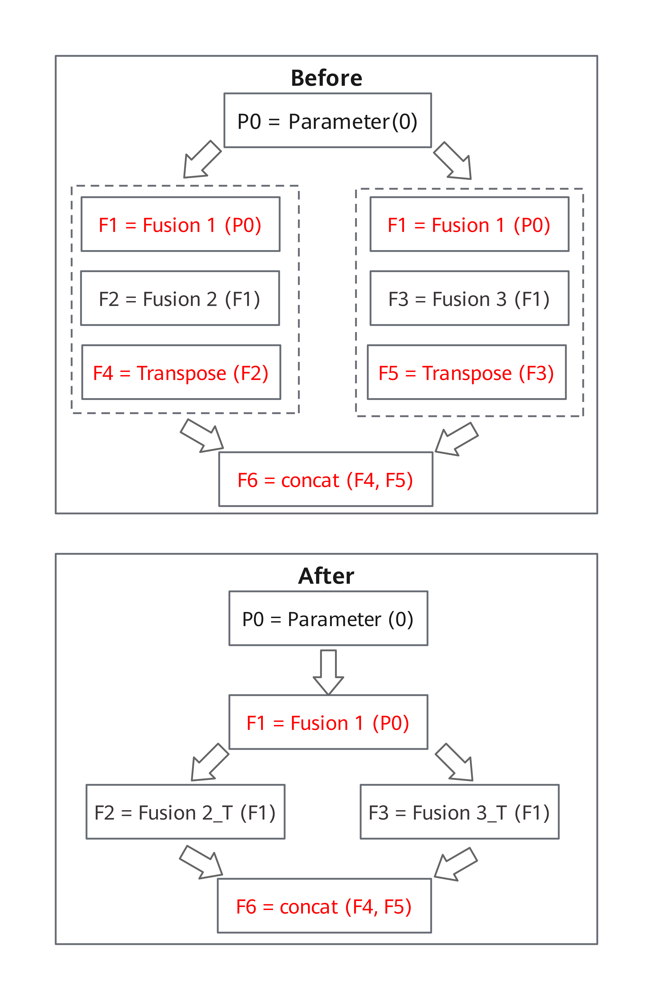
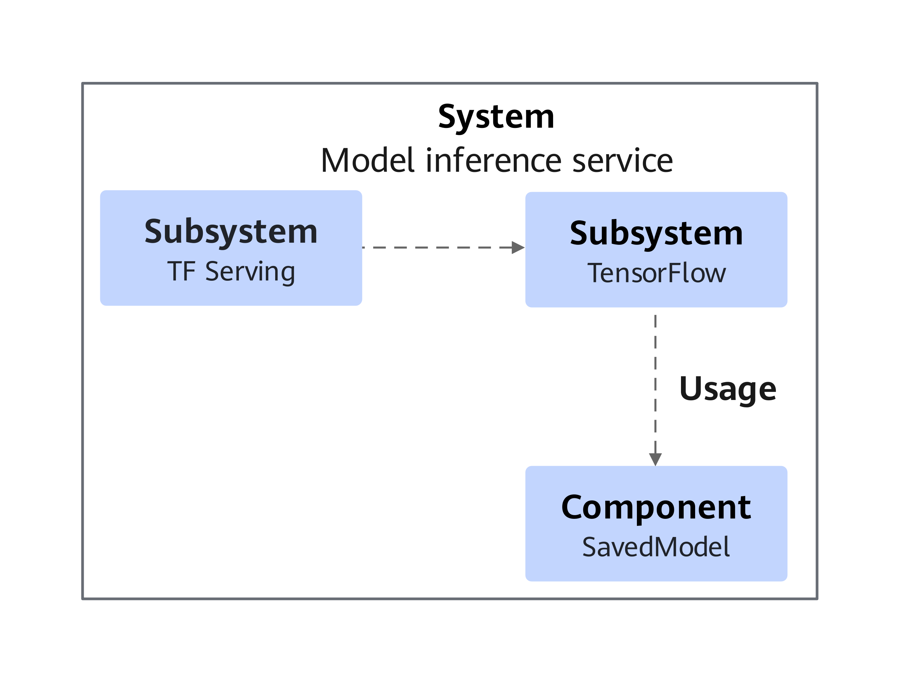
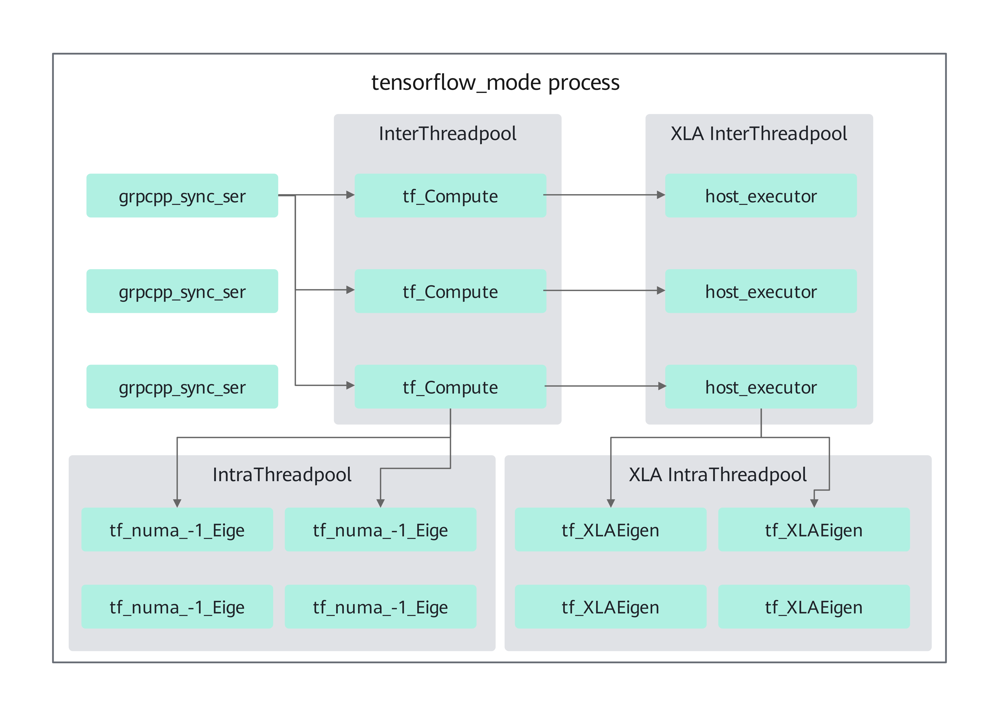
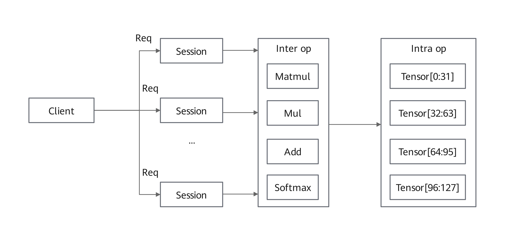
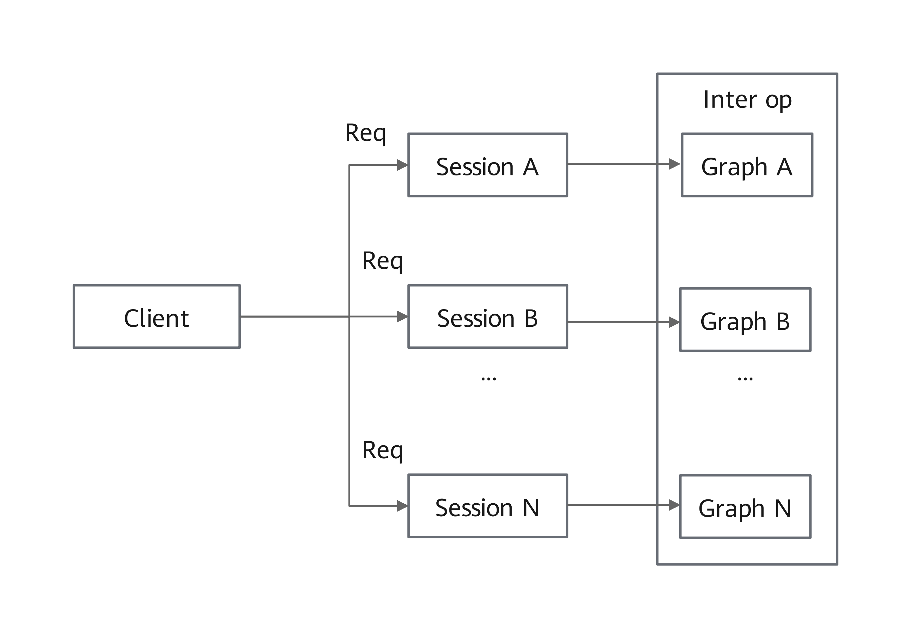

# Feature Introduction

## TensorFlow ANNC for Graph Compilation Optimization

### Overview

This section describes the basic concepts and implementation principles of the TensorFlow Accelerated Neural Network Compiler (ANNC) for graph compilation optimization.

Kunpeng BoostKit provides this TensorFlow ANNC feature to enhance TensorFlow Serving (TF Serving) inference performance. ANNC is a compiler dedicated to accelerating neural network computing. It focuses on technologies including computational graph optimization, generation and integration of high-performance fused operators, and efficient code generation. These capabilities significantly improve inference performance in recommendation scenarios. ANNC is an extended acceleration suite. It is built on open-source Open Accelerated Linear Algebra (OpenXLA), and hosted in the ANNC repository maintained by the openEuler community. The suite includes optimizations tailored for the Kunpeng platform, such as TensorFlow graph fusion, Accelerated Linear Algebra (XLA) graph fusion, and operator optimization.

The ANNC graph compilation optimization feature integrates with the TensorFlow inference framework and XLA through compilation options and code patches. The following new features are introduced for TensorFlow Serving/TensorFlow 2.15:

- TensorFlow graph fusion: fusion and rewriting of graphs at the TensorFlow model level.
- XLA graph fusion: XLA graph fusion enhanced by ANNC.
- Operator optimization: ANNC-driven operator optimization.

> **Note:**
>OpenXLA is an open ecosystem consisting of high-performance, portable, and scalable machine learning infrastructure components.
>XLA is an open-source compiler for machine learning. It optimizes models from the TensorFlow framework, to enable efficient execution across various hardware platforms including GPUs, CPUs, and machine learning accelerators.

### Software Architecture

[**Figure 1** TF Serving software architecture](#tf-serving-software-architecture) shows the TF Serving software architecture. [**Table 1** TF Serving software component functions](#tf-serving-software-component-functions) describes the functions of each component.

**Figure 1** TF Serving software architecture

**Table 1** TF Serving software component functions

<table><thead align="left"><tr id="row13527611645"><th class="cellrowborder" valign="top" width="20%" id="mcps1.2.3.1.1">
Component

</th>
<th class="cellrowborder" valign="top" width="80%" id="mcps1.2.3.1.2">
Description

</th>
</tr>
</thead>
<tbody><tr id="row9527411342"><td class="cellrowborder" valign="top" width="20%" headers="mcps1.2.3.1.1 ">
TF Serving

</td>
<td class="cellrowborder" valign="top" width="80%" headers="mcps1.2.3.1.2 ">
Dedicated, high-performance inference server optimized for TensorFlow model deployment

</td>
</tr>
<tr id="row890710021716"><td class="cellrowborder" valign="top" width="20%" headers="mcps1.2.3.1.1 ">
SavedModel

</td>
<td class="cellrowborder" valign="top" width="80%" headers="mcps1.2.3.1.2 ">
TensorFlow's standardized model format enabling seamless model import, inference, and retraining across diverse TensorFlow implementations

</td>
</tr>
<tr id="row552715117416"><td class="cellrowborder" valign="top" width="20%" headers="mcps1.2.3.1.1 ">
Graph Fusion

</td>
<td class="cellrowborder" valign="top" width="80%" headers="mcps1.2.3.1.2 ">
ANNC graph fusion component

</td>
</tr>
<tr id="row1552751643"><td class="cellrowborder" valign="top" width="20%" headers="mcps1.2.3.1.1 ">
TensorFlow

</td>
<td class="cellrowborder" valign="top" width="80%" headers="mcps1.2.3.1.2 ">
Open-source machine learning framework specializing in deep learning model training and inference

</td>
</tr>
<tr id="row1145126151312"><td class="cellrowborder" valign="top" width="20%" headers="mcps1.2.3.1.1 ">
ANNC

</td>
<td class="cellrowborder" valign="top" width="80%" headers="mcps1.2.3.1.2 ">
AI compiler optimized for machine learning models, which can compile models into high-performance executable code

</td>
</tr>
<tr id="row53481395136"><td class="cellrowborder" valign="top" width="20%" headers="mcps1.2.3.1.1 ">
XLA Extension

</td>
<td class="cellrowborder" valign="top" width="80%" headers="mcps1.2.3.1.2 ">
ANNC XLA extension

</td>
</tr>
<tr id="row512919311905"><td class="cellrowborder" valign="top" width="20%" headers="mcps1.2.3.1.1 ">
XLA

</td>
<td class="cellrowborder" valign="top" width="80%" headers="mcps1.2.3.1.2 ">
Open-source compiler for machine learning

</td>
</tr>
<tr id="row116041953806"><td class="cellrowborder" valign="top" width="20%" headers="mcps1.2.3.1.1 ">
Kernels

</td>
<td class="cellrowborder" valign="top" width="80%" headers="mcps1.2.3.1.2 ">
TensorFlow operator implementation

</td>
</tr>
</tbody>
</table>

### Application Scenarios

The TensorFlow Serving ANNC feature is mainly used in recommendation systems and advertising delivery. It can greatly improve inference performance for coarse-ranking models in high-concurrency scenarios, boosting throughput while significantly reducing latency.

### Principles

This section describes the TensorFlow/XLA optimization features.

**TensorFlow Graph Fusion**

Some subgraphs in TensorFlow models contain redundant computations. By identifying specific graph patterns, you can fuse multiple operators in the subgraphs into one fused operator. This avoids extra work, optimizes memory access, and improves model inference performance. For details, see [**Figure 1** TensorFlow graph fusion](#tensorflow-graph-fusion). This function enables graph fusion and rewriting at the TensorFlow model level on the frontend, and supports manual creation of custom fused operators on the backend.

**Figure 1** TensorFlow graph fusion

**XLA Graph Fusion**

XLA provides multiple hardware-agnostic graph fusion optimization policies. However, the resulting cluster (including the fused parts) may still contain redundant computations. For example, sub-expressions are repeated or can be merged across different fusion operations. For details, see [**Figure 2** XLA graph fusion](#xla-graph-fusion). This function aims to identify redundant computations after fusion, such as the F1 operations. Redundant computations can be eliminated using pre-fusion policies, such as the fusion of F4, F5, and F6 operations, to further improve the model inference efficiency.

**Figure 2** XLA graph fusion

**Operator Optimization**

This feature performs operator optimization across stages, including offloading the Matrix Multiplication (MatMul) operator to XLA, calling the General Matrix Multiplication (GEMM) operation interface provided by Open Basic Linear Algebra Subprograms (OpenBLAS), and replacing the Softmax function with a more efficient implementation. In addition, it identifies specific operation patterns to eliminate redundant computations and further improve the model inference performance. For example, in scenarios where multiple slices are concatenated, redundant slicing operations are removed.

For details about function configuration, see <a href="./quick_start.md">Quick Start</a>.

## TensorFlow Serving Thread Scheduling

### Overview

This section describes the basic concepts and implementation principles of the thread scheduling optimization feature for TensorFlow Serving.

Kunpeng BoostKit developed a thread scheduling optimization solution to enhance TF Serving inference performance. TensorFlow employs inter-operator thread pools to parallelize independent operators, this approach can lead to task contention in high-concurrency scenarios when multiple sessions share the same thread pool, substantially degrading computational efficiency for entire graphs. Kunpeng BoostKit's solution addresses this limitation through refined operator scheduling algorithms and advanced thread management optimizations, delivering significant throughput improvements for concurrent model inference.

Implemented as patches integrated into openEuler's `sra_tensorflow_adapter` repository, these optimizations introduce two new configuration parameters for TF Serving/TensorFlow 2.15:

- Batch operator scheduling (`--batch_op_scheduling`): Enables the operator scheduling optimization and XLA thread pool management optimization features. When single-core inference latency meets requirements, this option can be used to enhance concurrent processing capability and overall throughput.
- Thread affinity isolation (`--task_affinity_isolation`): Provides the following isolation methods: When the TensorFlow scheduling mode is used, sequential core binding is recommended. When this option is enabled together with the `--batch_op_scheduling` option, and hyper-threading is enabled, interleaved core binding is recommended.
  - Sequential core binding allocates TensorFlow computing threads to the first K cores and TF Serving communication threads to remaining cores.
  - Interleaved core binding (applicable when hyper-threading is enabled) assigns TensorFlow threads to physical cores and TF Serving communication threads to virtual cores.

> **Note:**
>XLA serves as TensorFlow's optimizing compiler, specifically designed to enhance the execution speed of linear algebra operations. By transforming TensorFlow computational graphs into highly efficient, hardware-specific instructions, XLA delivers significant performance improvements.

### Software Architecture

[**Figure 1** TF Serving software architecture](#tf-serving-software-architecture-1) shows the TF Serving software architecture. [**Table 1** TF Serving component functions](#tf-serving-component-functions) describes the functions of each module.

**Figure 1** TF Serving software architecture

**Table 1** TF Serving component functions

<table><thead align="left"><tr id="row13527611645"><th class="cellrowborder" valign="top" width="23.02%" id="mcps1.2.3.1.1">
Component

</th>
<th class="cellrowborder" valign="top" width="76.98%" id="mcps1.2.3.1.2">
Description

</th>
</tr>
</thead>
<tbody><tr id="row9527411342"><td class="cellrowborder" valign="top" width="23.02%" headers="mcps1.2.3.1.1 ">
TF Serving

</td>
<td class="cellrowborder" valign="top" width="76.98%" headers="mcps1.2.3.1.2 ">
Dedicated, high-performance inference server optimized for TensorFlow model deployment

</td>
</tr>
<tr id="row552715117416"><td class="cellrowborder" valign="top" width="23.02%" headers="mcps1.2.3.1.1 ">
TensorFlow

</td>
<td class="cellrowborder" valign="top" width="76.98%" headers="mcps1.2.3.1.2 ">
Open-source machine learning framework specializing in deep learning model training and inference

</td>
</tr>
<tr id="row1552751643"><td class="cellrowborder" valign="top" width="23.02%" headers="mcps1.2.3.1.1 ">
SavedModel

</td>
<td class="cellrowborder" valign="top" width="76.98%" headers="mcps1.2.3.1.2 ">
TensorFlow's standardized model format enabling seamless model import, inference, and retraining across diverse TensorFlow implementations

</td>
</tr>
</tbody>
</table>

### Application Scenarios

The TF Serving thread scheduling optimization feature delivers adaptable solutions for diverse inference workloads:

- It can greatly improve inference performance for coarse-ranking models in high-concurrency scenarios, boosting throughput while significantly reducing latency.
- Effectively optimizes latency-sensitive, low-concurrency scenarios through proper thread management parameter configuration.

### Principles

This section details TF Serving's thread pool architecture for inference, clarifying the principles of the feature to guide optimal configuration decisions.

**Figure 1** TF Serving thread pool overview

The inference threads in TF Serving fall into two functional categories: communication threads and computing threads.

Communication threads:

- `grpcpp_sync_ser` threads manage client inference requests (including parsing, inference triggering, and response delivery).

Computing threads:

- `tf_Compute` threads coordinate parallel tasks across operators.
- `tf_numa_-1_Eige` threads execute intra-operator parallel tasks.

XLA-enabled deployments create threads for XLA computation.

- `host_executor` threads coordinate parallel tasks across XLA operators.
- `tf_XLAEigen` threads execute intra-XLA-operator parallel tasks.

[**Figure 2** Inference request handling process](#inference-request-handling-process) shows the overall inference request handling process.

**Figure 2** Inference request handling process

Client inference requests are parsed by `grpcpp_sync_ser` threads before triggering session-based inference execution. Parallel operator processing occurs through `tf_Compute or host_executor` threads, with `tf_numa_-1_Eige` or `tf_XLAEigen` threads handling intra-operator parallel computing.

Kunpeng BoostKit improves the operator scheduling algorithm and uses batch operator scheduling. [**Figure 3** Inference process after optimization](#inference-process-after-optimization) shows the overall inference process.

**Figure 3** Inference process after optimization

Client inference requests are parsed by `grpcpp_sync_ser` threads before triggering session-based inference, with operators running sequentially in `tf_Compute` threads (disabling intra-operator parallelism).

This optimization reduces cross-session interference, enabling lower per-session inference latency, improved TF Serving concurrency, and additional gains from thread affinity isolation between communication and computing threads.

The thread scheduling feature enables:

- Batch operator scheduling (via `--batch_op_scheduling`) for enhanced throughput in high-concurrency scenarios
- Optimized XLA thread pool management, enabled alongside batch operator scheduling, to schedule XLA operators onto the current thread, thereby reducing context switching overhead.
- Configurable thread affinity isolation (via `--task_affinity_isolation`) for binding communication and computing threads to different CPU cores

For details about function configuration, see <a href="./quick_start.md">Quick Start</a>.
