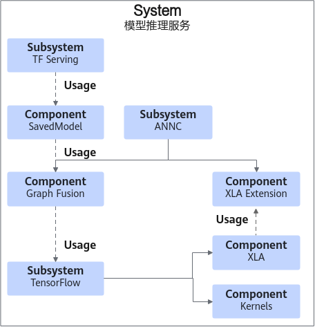
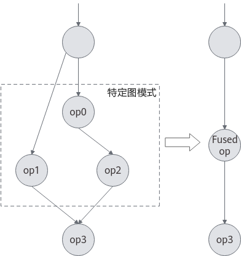
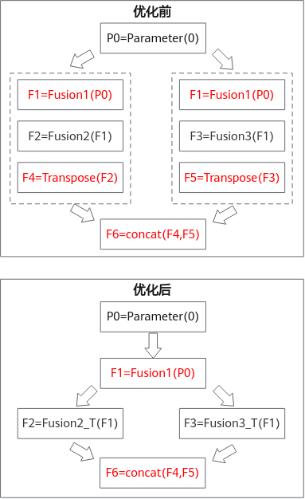
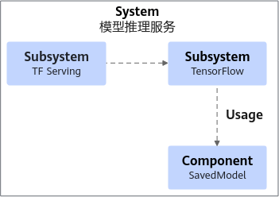
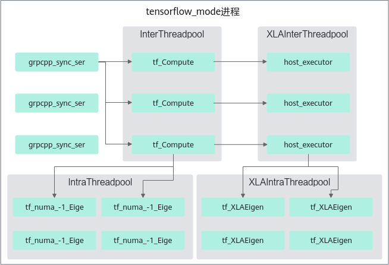
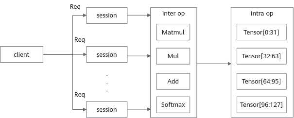
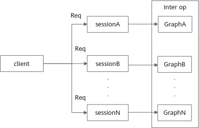

# 特性介绍

## TensorFlow ANNC 图编译优化特性

### 简介

本章节介绍了TensorFlow ANNC（Accelerated Neural Network Compiler）图编译优化特性的基本概念和实现原理。

为提升TensorFlow Serving（以下简称TF Serving）推理性能，鲲鹏BoostKit提出了TensorFlow ANNC图编译优化方案。ANNC是专注于加速神经网络计算的编译器，聚焦于通过计算图优化，高性能融合算子生成和对接技术，高效代码生成和优化能力，加速推荐的推理性能。ANNC作为基于开源OpenXLA（Open Accelerated Linear Algebra）的扩展加速套件，发布在openEuler组织的ANNC开源仓，具有鲲鹏亲和的优化特性，包括TensorFlow图融合、XLA（Accelerated Linear Algebra）图融合、算子优化。

ANNC图编译优化特性通过编译选项和代码补丁的方式接入TensorFlow推理框架和XLA，基于TensorFlow Serving/TensorFlow 2.15版本新增以下特性：

- TensorFlow图融合：提供TensorFlow模型层面的图融合与图重写功能。
- XLA图融合：提供ANNC XLA图融合特性。
- 算子优化：提供ANNC算子优化特性。

> **说明：** 
>OpenXLA是一个由高性能、可移植、可扩展的机器学习基础架构组件组成的开放生态系统。
>XLA是一种开源机器学习编译器。XLA编译器从TensorFlow框架获取模型，并优化模型以便在不同硬件平台（包括GPU、CPU和机器学习加速器）上实现高性能执行。

### 软件架构

TF Serving软件架构如[**图 1** TF Serving软件架构](#TF-Serving软件架构)所示，组件功能如[**表 1** TF Serving软件组件功能介绍](#TF-Serving软件组件功能介绍)所示。

**图 1** TF Serving软件架构

**表 1** TF Serving软件组件功能介绍

<table><thead align="left"><tr id="row13527611645"><th class="cellrowborder" valign="top" width="20%" id="mcps1.2.3.1.1">
组件名称

</th>
<th class="cellrowborder" valign="top" width="80%" id="mcps1.2.3.1.2">
描述

</th>
</tr>
</thead>
<tbody><tr id="row9527411342"><td class="cellrowborder" valign="top" width="20%" headers="mcps1.2.3.1.1 ">
TF Serving

</td>
<td class="cellrowborder" valign="top" width="80%" headers="mcps1.2.3.1.2 ">
专为TensorFlow模型部署设计的高性能推理服务端。

</td>
</tr>
<tr id="row890710021716"><td class="cellrowborder" valign="top" width="20%" headers="mcps1.2.3.1.1 ">
SavedModel

</td>
<td class="cellrowborder" valign="top" width="80%" headers="mcps1.2.3.1.2 ">
TensorFlow提供的一种标准化的模型保存格式，训练好的模型能够在不同的TensorFlow环境中进行导入、推理和再训练。

</td>
</tr>
<tr id="row552715117416"><td class="cellrowborder" valign="top" width="20%" headers="mcps1.2.3.1.1 ">
Graph Fusion

</td>
<td class="cellrowborder" valign="top" width="80%" headers="mcps1.2.3.1.2 ">
ANNC图融合模块。

</td>
</tr>
<tr id="row1552751643"><td class="cellrowborder" valign="top" width="20%" headers="mcps1.2.3.1.1 ">
TensorFlow

</td>
<td class="cellrowborder" valign="top" width="80%" headers="mcps1.2.3.1.2 ">
开源的机器学习框架，主要用于深度学习模型的训练和推理。

</td>
</tr>
<tr id="row1145126151312"><td class="cellrowborder" valign="top" width="20%" headers="mcps1.2.3.1.1 ">
ANNC

</td>
<td class="cellrowborder" valign="top" width="80%" headers="mcps1.2.3.1.2 ">
专为机器学习模型优化的AI编译器，能够将模型编译成高性能可执行代码。

</td>
</tr>
<tr id="row53481395136"><td class="cellrowborder" valign="top" width="20%" headers="mcps1.2.3.1.1 ">
XLA Extension

</td>
<td class="cellrowborder" valign="top" width="80%" headers="mcps1.2.3.1.2 ">
ANNC基于XLA的扩展组件。

</td>
</tr>
<tr id="row512919311905"><td class="cellrowborder" valign="top" width="20%" headers="mcps1.2.3.1.1 ">
XLA

</td>
<td class="cellrowborder" valign="top" width="80%" headers="mcps1.2.3.1.2 ">
开源机器学习编译器。

</td>
</tr>
<tr id="row116041953806"><td class="cellrowborder" valign="top" width="20%" headers="mcps1.2.3.1.1 ">
Kernels

</td>
<td class="cellrowborder" valign="top" width="80%" headers="mcps1.2.3.1.2 ">
TensorFlow算子实现。

</td>
</tr>
</tbody>
</table>

### 应用场景

TensorFlow ANNC图编译优化特性主要在推荐系统和广告投放中使用。对于高并发粗排模型推理场景优化效果明显，表现在吞吐量的提升和推理时延大幅下降。

### 原理描述

本节针对TensorFlow/XLA的优化特性进行描述，以帮助用户更好地使用。

**TensorFlow图融合**

在TensorFlow模型中存在一些子图包含冗余计算，通过识别特定的图模式，将子图中的多个算子融合为一个“融合算子”，能够避免冗余计算，优化访存，提升模型推理性能，如[**图 1** TensorFlow图融合示意图](#TensorFlow图融合示意图)所示。本功能在前端提供TensorFlow模型层面的图融合与图重写功能，在后端提供“自定义融合算子”的手动实现。

**图 1** TensorFlow图融合示意图

**XLA图融合**

XLA自身提供了多种与硬件无关的图融合优化策略，但是优化后的聚类（包括融合部分）仍可能包含重复计算，即多个融合操作之间存在相同或可合并的子表达式。如[**图 2** XLA图融合示意图](#XLA图融合示意图)所示，本功能旨在识别融合后的重复计算，如[**图 2** XLA图融合示意图](#XLA图融合示意图)中F1操作；并通过预融合策略消除冗余计算，如[**图 2** XLA图融合示意图](#XLA图融合示意图)中F4、F5、F6操作的融合，以进一步提升模型推理效率。

**图 2** XLA图融合示意图

**算子优化**

本功能包含各阶段的算子优化，包括将MatMul（Matrix Multiplication）算子下发至XLA，调用OpenBLAS（Open Basic Linear Algebra Subprograms）所提供的GEMM（General Matrix Multiplication）运算接口，包括将Softmax函数替换为更高效的实现；同时本功能通过识别特定的操作模式，减少其中的冗余操作，进一步提升模型的推理性能，例如：针对多个切片后进行拼接的模式，删除其中冗余的切片操作。

功能配置的详细说明请见<a href="./quick_start.md">快速入门</a>

## TensorFlow Serving 线程调度优化特性

### 简介

本章节介绍了TensorFlow Serving线程调度优化特性的基本概念和实现原理。

为提升TensorFlow Serving（以下简称TF Serving）推理性能，鲲鹏BoostKit提出了TensorFlow Serving线程调度优化方案。传统TensorFlow使用算子间的线程池并行计算不同的算子，虽可实现没有数据依赖的算子的并发执行，但在高并发场景下，多Session共享算子间线程池会导致任务抢占，严重降低整图计算效率。针对这一痛点，鲲鹏BoostKit TensorFlow Serving线程调度优化特性改进了算子调度算法，并加入了其他线程管理优化，有效提升了高并发场景下的模型推理吞吐量。

TensorFlow Serving线程调度优化特性以Patch的方式实现，并合入了openEuler组织的sra\_tensorflow\_adapter开源仓库，基于TF Serving/TensorFlow 2.15版本新增以下两种特性开关：

- 算子批量调度（--batch\_op\_scheduling）：使能算子调度优化和XLA线程池管理优化特性。如果单核推理时延可满足业务要求，可配置该选项提升推理并发能力和吞吐量。
- 线程亲和性隔离（--task\_affinity\_isolation）提供以下两种隔离方式。使用TensorFlow调度方式运行时，推荐设置为顺序绑核；与--batch\_op\_scheduling选项同时使能，并开启超线程时，推荐设置为交叉绑核。
    - 顺序绑核，TensorFlow计算线程绑定到前K个核，TF Serving通信线程绑定到其余核。
    - 交叉绑核，适用于开启超线程的场景，将TensorFlow线程绑定到物理核，TF Serving通信线程绑定到虚拟核。

> **说明：** 
>XLA（Accelerated Linear Algebra）是TensorFlow中的优化编译器，用于加速线性代数操作的执行。XLA通过将TensorFlow的计算图转换成高效的、低级别的硬件指令，从而提升计算性能。

### 软件架构

TF Serving软件架构如[**图 1** TF Serving软件架构](#TF-Serving软件架构_1)所示，模块功能如[**表 1** TF Serving软件模块功能介绍](#TF-Serving软件模块功能介绍)所示。

**图 1** TF Serving软件架构

**表 1** TF Serving软件模块功能介绍

<table><thead align="left"><tr id="row13527611645"><th class="cellrowborder" valign="top" width="23.02%" id="mcps1.2.3.1.1">
模块名称

</th>
<th class="cellrowborder" valign="top" width="76.98%" id="mcps1.2.3.1.2">
描述

</th>
</tr>
</thead>
<tbody><tr id="row9527411342"><td class="cellrowborder" valign="top" width="23.02%" headers="mcps1.2.3.1.1 ">
TF Serving

</td>
<td class="cellrowborder" valign="top" width="76.98%" headers="mcps1.2.3.1.2 ">
专为TensorFlow模型部署设计的高性能推理服务端。

</td>
</tr>
<tr id="row552715117416"><td class="cellrowborder" valign="top" width="23.02%" headers="mcps1.2.3.1.1 ">
TensorFlow

</td>
<td class="cellrowborder" valign="top" width="76.98%" headers="mcps1.2.3.1.2 ">
开源的机器学习框架，主要用于深度学习模型的训练和推理。

</td>
</tr>
<tr id="row1552751643"><td class="cellrowborder" valign="top" width="23.02%" headers="mcps1.2.3.1.1 ">
SavedModel

</td>
<td class="cellrowborder" valign="top" width="76.98%" headers="mcps1.2.3.1.2 ">
TensorFlow提供的一种标准化的模型保存格式，训练好的模型能够在不同的TensorFlow环境中进行导入、推理和再训练。

</td>
</tr>
</tbody>
</table>

### 应用场景

TensorFlow Serving线程调度优化特性对不同推理场景提供了灵活有效的选项。

- 对于高并发粗排模型推理场景优化效果明显，表现在吞吐量的提升和推理时延大幅下降。
- 对于并发不高且时延敏感的场景，合理配置线程管理参数也能达到优化效果。

### 原理描述

首先介绍TF Serving推理时使用的线程池，以更好理解本特性的工作原理，从而根据实际场景决定特性的开关和设置。

**图 1** TF Serving线程池运行视图

TF Serving用于推理的线程大致分为两类：通信线程和计算线程。

通信线程：

- grpcpp\_sync\_ser线程，处理客户端推理请求，包含请求解析、启动推理、请求返回等任务。

计算线程：

- tf\_Compute线程，处理算子间的并行计算任务。
- tf\_numa\_-1\_Eige线程，处理算子内部的并行计算任务。

当开启XLA特性时，将创建用于XLA计算的线程：

- host\_executor线程，处理XLA算子间的并行计算任务。
- tf\_XLAEigen线程，处理XLA算子内部的并行计算任务。

整体推理请求流程如[**图 2** 推理请求处理流程图](#推理请求处理流程图)所示。

**图 2** 推理请求处理流程图

客户端发送推理请求到grpcpp\_sync\_ser线程解析，然后启动Session执行推理，tf\_Compute/host\_executor线程并行执行不同的算子，tf\_numa\_-1\_Eige/tf\_XLAEigen线程执行算子内部的并发计算。

鲲鹏BoostKit改进了算子调度算法，采用算子批量调度，改进后，整体推理流程如[**图 3** 优化后推理流程图](#优化后推理流程图)所示。

**图 3** 优化后推理流程图

客户端发送推理请求到grpcpp\_sync\_ser线程解析，并启动Session执行推理，算子按顺序在tf\_Compute线程串行执行计算，取消了算子内部的并发计算。

改进后，减少了Session间推理任务的互相干扰，使得单个Session能够以更低的时延完成推理，并增强了TF Serving的并发性能。同时注意到通信线程和计算线程处理的是不同类型的任务，可以设置线程亲和性进行隔离，也能获得一定的性能收益。

线程调度特性支持的功能：

- 算子批量调度，通过--batch\_op\_scheduling配置，提升高并发场景下的吞吐量。
- 优化XLA线程池管理，与算子批量调度功能同步使能，将XLA算子调度到当前线程，减少线程上下文切换开销。
- 支持线程亲和性隔离，通过--task\_affinity\_isolation配置，可以将通信线程和计算线程绑定在不同的CPU核心上。

功能配置的详细说明请见<a href="./quick_start.md">快速入门</a>
