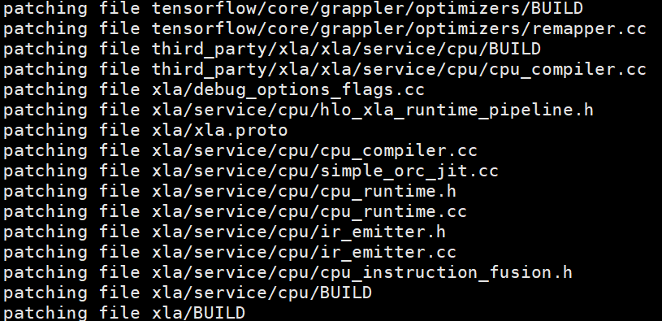

# 安装指南

## TensorFlow ANNC 图编译优化

### 已验证环境

为保证您可以顺利安全地使用TensorFlow ANNC图编译优化特性，请确保所使用的环境信息在已验证环境范围内。

**硬件要求<a name="section230mcpsimp"></a>**

已验证的硬件环境如[**表 1** 硬件要求](#硬件要求)所示。

**表 1** 硬件要求<a id="硬件要求"></a>

<a name="_table38928044"></a>
<table><thead align="left"><tr id="row239mcpsimp"><th class="cellrowborder" valign="top" width="20%" id="mcps1.2.3.1.1"><p id="p241mcpsimp"><a name="p241mcpsimp"></a><a name="p241mcpsimp"></a>项目</p>
</th>
<th class="cellrowborder" valign="top" width="80%" id="mcps1.2.3.1.2"><p id="p243mcpsimp"><a name="p243mcpsimp"></a><a name="p243mcpsimp"></a>说明</p>
</th>
</tr>
</thead>
<tbody><tr id="row245mcpsimp"><td class="cellrowborder" valign="top" width="20%" headers="mcps1.2.3.1.1 "><p id="p247mcpsimp"><a name="p247mcpsimp"></a><a name="p247mcpsimp"></a>CPU</p>
</td>
<td class="cellrowborder" valign="top" width="80%" headers="mcps1.2.3.1.2 "><p id="p249mcpsimp"><a name="p249mcpsimp"></a><a name="p249mcpsimp"></a>鲲鹏920 7282C处理器（80核）</p>
</td>
</tr>
</tbody>
</table>

**操作系统要求<a name="section250mcpsimp"></a>**

已验证的操作系统如[**表 2** 操作系统](#操作系统)所示。

**表 2** 操作系统<a id="操作系统"></a>

<a name="_d0e164"></a>
<table><thead align="left"><tr id="row261mcpsimp"><th class="cellrowborder" valign="top" width="10.24%" id="mcps1.2.5.1.1"><p id="p263mcpsimp"><a name="p263mcpsimp"></a><a name="p263mcpsimp"></a>项目</p>
</th>
<th class="cellrowborder" valign="top" width="23.73%" id="mcps1.2.5.1.2"><p id="p265mcpsimp"><a name="p265mcpsimp"></a><a name="p265mcpsimp"></a>版本</p>
</th>
<th class="cellrowborder" valign="top" width="45.519999999999996%" id="mcps1.2.5.1.3"><p id="p267mcpsimp"><a name="p267mcpsimp"></a><a name="p267mcpsimp"></a>说明</p>
</th>
<th class="cellrowborder" valign="top" width="20.51%" id="mcps1.2.5.1.4"><p id="p269mcpsimp"><a name="p269mcpsimp"></a><a name="p269mcpsimp"></a>下载地址</p>
</th>
</tr>
</thead>
<tbody><tr id="row271mcpsimp"><td class="cellrowborder" valign="top" width="10.24%" headers="mcps1.2.5.1.1 "><p id="p273mcpsimp"><a name="p273mcpsimp"></a><a name="p273mcpsimp"></a>OS</p>
</td>
<td class="cellrowborder" valign="top" width="23.73%" headers="mcps1.2.5.1.2 "><p id="p275mcpsimp"><a name="p275mcpsimp"></a><a name="p275mcpsimp"></a>openEuler 22.03 LTS SP3</p>
</td>
<td class="cellrowborder" valign="top" width="45.519999999999996%" headers="mcps1.2.5.1.3 "><p id="p277mcpsimp"><a name="p277mcpsimp"></a><a name="p277mcpsimp"></a>如果是全新安装操作系统，可选择“Minimal Install”安装方式并勾选Development Tools套件，否则很多软件包需要手动安装。</p>
</td>
<td class="cellrowborder" valign="top" width="20.51%" headers="mcps1.2.5.1.4 "><p id="p279mcpsimp"><a name="p279mcpsimp"></a><a name="p279mcpsimp"></a><a href="https://repo.openeuler.org/openEuler-22.03-LTS-SP3/ISO/aarch64/" target="_blank" rel="noopener noreferrer">获取链接</a></p>
</td>
</tr>
<tr id="row281mcpsimp"><td class="cellrowborder" valign="top" width="10.24%" headers="mcps1.2.5.1.1 "><p id="p283mcpsimp"><a name="p283mcpsimp"></a><a name="p283mcpsimp"></a>Kernel</p>
</td>
<td class="cellrowborder" valign="top" width="23.73%" headers="mcps1.2.5.1.2 "><p id="p285mcpsimp"><a name="p285mcpsimp"></a><a name="p285mcpsimp"></a>5.10.0</p>
</td>
<td class="cellrowborder" valign="top" width="45.519999999999996%" headers="mcps1.2.5.1.3 "><p id="p287mcpsimp"><a name="p287mcpsimp"></a><a name="p287mcpsimp"></a>-</p>
</td>
<td class="cellrowborder" valign="top" width="20.51%" headers="mcps1.2.5.1.4 "><p id="p289mcpsimp"><a name="p289mcpsimp"></a><a name="p289mcpsimp"></a>包含在操作系统镜像中。</p>
</td>
</tr>
</tbody>
</table>

**软件要求<a name="section290mcpsimp"></a>**

已验证的软件依赖环境如[**表 3** 软件要求](#软件要求)所示。

**表 3** 软件要求<a id="软件要求"></a>

<a name="_table237115053311"></a>
<table><thead align="left"><tr id="row301mcpsimp"><th class="cellrowborder" valign="top" width="10.100000000000001%" id="mcps1.2.5.1.1"><p id="p303mcpsimp"><a name="p303mcpsimp"></a><a name="p303mcpsimp"></a>项目</p>
</th>
<th class="cellrowborder" valign="top" width="23.84%" id="mcps1.2.5.1.2"><p id="p305mcpsimp"><a name="p305mcpsimp"></a><a name="p305mcpsimp"></a>版本</p>
</th>
<th class="cellrowborder" valign="top" width="45.48%" id="mcps1.2.5.1.3"><p id="p307mcpsimp"><a name="p307mcpsimp"></a><a name="p307mcpsimp"></a>说明</p>
</th>
<th class="cellrowborder" valign="top" width="20.580000000000002%" id="mcps1.2.5.1.4"><p id="p309mcpsimp"><a name="p309mcpsimp"></a><a name="p309mcpsimp"></a>下载地址</p>
</th>
</tr>
</thead>
<tbody><tr id="row321mcpsimp"><td class="cellrowborder" valign="top" width="10.100000000000001%" headers="mcps1.2.5.1.1 "><p id="p323mcpsimp"><a name="p323mcpsimp"></a><a name="p323mcpsimp"></a>Python</p>
</td>
<td class="cellrowborder" valign="top" width="23.84%" headers="mcps1.2.5.1.2 "><p id="p325mcpsimp"><a name="p325mcpsimp"></a><a name="p325mcpsimp"></a>3.9.9</p>
</td>
<td class="cellrowborder" valign="top" width="45.48%" headers="mcps1.2.5.1.3 "><p id="p327mcpsimp"><a name="p327mcpsimp"></a><a name="p327mcpsimp"></a>Python是TF Serving的构建过程中的辅助工具，起到自动下载依赖、配置环境等作用。</p>
</td>
<td class="cellrowborder" valign="top" width="20.580000000000002%" headers="mcps1.2.5.1.4 "><p id="p329mcpsimp"><a name="p329mcpsimp"></a><a name="p329mcpsimp"></a>通过Yum源方式安装。</p>
</td>
</tr>
<tr id="row330mcpsimp"><td class="cellrowborder" valign="top" width="10.100000000000001%" headers="mcps1.2.5.1.1 "><p id="p332mcpsimp"><a name="p332mcpsimp"></a><a name="p332mcpsimp"></a>CMake</p>
</td>
<td class="cellrowborder" valign="top" width="23.84%" headers="mcps1.2.5.1.2 "><p id="p334mcpsimp"><a name="p334mcpsimp"></a><a name="p334mcpsimp"></a>3.22.0</p>
</td>
<td class="cellrowborder" valign="top" width="45.48%" headers="mcps1.2.5.1.3 "><p id="p336mcpsimp"><a name="p336mcpsimp"></a><a name="p336mcpsimp"></a>CMake是TF Serving的构建工具，要求CMake版本为3.22.0及以上。</p>
</td>
<td class="cellrowborder" valign="top" width="20.580000000000002%" headers="mcps1.2.5.1.4 "><p id="p338mcpsimp"><a name="p338mcpsimp"></a><a name="p338mcpsimp"></a>通过Yum源方式安装。</p>
</td>
</tr>
<tr id="row339mcpsimp"><td class="cellrowborder" valign="top" width="10.100000000000001%" headers="mcps1.2.5.1.1 "><p id="p341mcpsimp"><a name="p341mcpsimp"></a><a name="p341mcpsimp"></a>GCC/G++</p>
</td>
<td class="cellrowborder" valign="top" width="23.84%" headers="mcps1.2.5.1.2 "><p id="p343mcpsimp"><a name="p343mcpsimp"></a><a name="p343mcpsimp"></a>12.3.1</p>
</td>
<td class="cellrowborder" valign="top" width="45.48%" headers="mcps1.2.5.1.3 "><p id="p345mcpsimp"><a name="p345mcpsimp"></a><a name="p345mcpsimp"></a>GCC（GNU Compiler Collection）是一种编程语言编译器，用于将TF Serving编译为可执行文件。</p>
</td>
<td class="cellrowborder" valign="top" width="20.580000000000002%" headers="mcps1.2.5.1.4 "><p id="p347mcpsimp"><a name="p347mcpsimp"></a><a name="p347mcpsimp"></a>通过Yum源方式安装。</p>
</td>
</tr>
<tr id="row348mcpsimp"><td class="cellrowborder" valign="top" width="10.100000000000001%" headers="mcps1.2.5.1.1 "><p id="p8254102818211"><a name="p8254102818211"></a><a name="p8254102818211"></a>Bazel</p>
</td>
<td class="cellrowborder" valign="top" width="23.84%" headers="mcps1.2.5.1.2 "><p id="p525314288218"><a name="p525314288218"></a><a name="p525314288218"></a>6.5.0</p>
</td>
<td class="cellrowborder" valign="top" width="45.48%" headers="mcps1.2.5.1.3 "><p id="p10253172810219"><a name="p10253172810219"></a><a name="p10253172810219"></a>Bazel是一个强大的构建系统，可实现快速、可扩展构建，要求Bazel版本为6.4.0以上。</p>
</td>
<td class="cellrowborder" valign="top" width="20.51%" headers="mcps1.2.5.1.4 "><p id="p279mcpsimp"><a name="p279mcpsimp"></a><a name="p279mcpsimp"></a><a href="https://releases.bazel.build/6.5.0/release/bazel-6.5.0-dist.zip" target="_blank" rel="noopener noreferrer">获取链接</a></p>
</td>
</tr>
<tr id="row8837155216431"><td class="cellrowborder" valign="top" width="10.100000000000001%" headers="mcps1.2.5.1.1 "><p id="p17838135224315"><a name="p17838135224315"></a><a name="p17838135224315"></a>TensorFlow</p>
</td>
<td class="cellrowborder" valign="top" width="23.84%" headers="mcps1.2.5.1.2 "><p id="p138385526435"><a name="p138385526435"></a><a name="p138385526435"></a>2.15.1</p>
</td>
<td class="cellrowborder" valign="top" width="45.48%" headers="mcps1.2.5.1.3 "><p id="p7838052104314"><a name="p7838052104314"></a><a name="p7838052104314"></a>TensorFlow是由Google开发的开源机器学习框架，支持从研究到生产的端到端AI模型开发与部署。</p>
</td>
<td class="cellrowborder" valign="top" width="20.580000000000002%" headers="mcps1.2.5.1.4 "><p id="p10838352174310"><a name="p10838352174310"></a><a name="p10838352174310"></a>通过pip源方式安装。</p>
</td>
</tr>
</tbody>
</table>

### 准备环境

请参见《TensorFlow Serving推理部署框架 移植指南》中的“[配置编译环境](https://www.hikunpeng.com/document/detail/zh/SRA/ecosystemEnable/TensorFlowServing/kunpengtfserving_02_0005.html)”章节和[**表 3** 软件要求](#软件要求)，准备TF Serving编译环境。

### 编译安装

TensorFlow ANNC图编译优化特性后端已合入TensorFlow和TF Serving开源仓，图融合前端优化，XLA图融合，算子优化相关代码发布在Gitcode托管的ANNC开源仓，可使用**git**拉取完整代码后进行代码编译操作。

**获取代码<a name="section12640151210390"></a>**

1. 配置Git取消SSL验证。

    ```bash
    git config --global http.sslVerify false
    git config --global https.sslVerify false
    ```

2. 拉取TensorFlow和TF Serving代码。

    ```bash
    git clone --branch v2.15.0-2509 https://gitcode.com/boostkit/tensorflow.git
    git clone --branch v2.15.1-2509 https://gitcode.com/boostkit/tensorflow-serving.git
    ```

3. 拉取ANNC代码。

    ```bash
    git clone --branch v0.0.2 https://gitcode.com/openeuler/ANNC.git
    ```

**编译安装<a name="section176411312143912"></a>**

1. 安装GCC 12.3.1版本。

    ```bash
    yum install -y gcc-toolset-12-gcc*
    export PATH=/opt/openEuler/gcc-toolset-12/root/usr/bin/:$PATH
    export LD_LIBRARY_PATH=/opt/openEuler/gcc-toolset-12/root/usr/lib64/:$LD_LIBRARY_PATH
    ```

2. 编译安装ANNC。

    ```bash
    export ANNC=/path/to/ANNC
    cd $ANNC
    source build.sh
    cp bazel-bin/annc/service/cpu/libannc.so /usr/lib64/
    cp $ANNC/annc/service/cpu/xla/libs/XNNPACK/build/libXNNPACK.so /usr/lib64
    mkdir -p /usr/include/annc 
    cp annc/service/cpu/kdnn_rewriter.h /usr/include/annc/ 
    cp annc/service/cpu/annc_flags.h /usr/include/annc/
    cd python
    python3 setup.py bdist_wheel
    python3 -m pip install dist/*.whl --force-reinstall
    ```

3. 使能补丁。

    ```bash
    export TF_PATH=/path/to/tensorflow
    export XLA_PATH=/path/to/tensorflow/third_party/xla
    cd $ANNC/install/tfserver/xla
    bash xla2.sh
    ```

    使能补丁成功如[**图 1** 使能补丁成功示意图](#使能补丁成功示意图)所示。

    **图 1** 使能补丁成功示意图<a name="fig5303357205213"></a><a id="使能补丁成功示意图"></a>
    
    

4. 进入“tensorflow-serving“目录。

    ```bash
    cd /path/to/tensorflow-serving/
    ```

5. 创建编译依赖存储目录

    ```bash
    export DISTDIR=$(pwd)/download
    mkdir -p $DISTDIR
    ```

6. 设置Bazel编译工具路径，需指向Bazel可执行文件所在的目录。

    ```bash
    export BAZEL_PATH=/path/to/bazel
    ```

7. 执行构建脚本编译。

    ```bash
    sh compile_serving.sh --tensorflow_dir /path/to/tensorflow --features gcc12,annc
    ```

    “/path/to/tensorflow”指定TensorFlow路径。

    构建的结果为TF Serving二进制文件“tensorflow\_model\_server”，文件路径为“/path/to/tensorflow-serving/bazel-bin/tensorflow\_serving/model\_servers/tensorflow\_model\_server”。

    以上构建脚本编译命令中**gcc12**表示使用GCC 12.3.1版本编译。构建脚本中执行的编译命令为：

    ```bash
    bazel --output_user_root=$BAZEL_COMPILE_CACHE build -c opt --distdir=$DISTDIR --override_repository=org_tensorflow=$TENSORFLOW_DIR \
    --copt=-march=armv8.3-a+crc --copt=-O3 --copt=-fprefetch-loop-arrays --copt=-Wno-error=maybe-uninitialized  \ 
    --copt=-Werror=stringop-overflow=0 --config=fused_embedding  \ 
    --define tflite_with_xnnpack=false tensorflow_serving/model_servers:tensorflow_model_server
    ```

    其中部分参数介绍如下：

    - --output\_user\_root：Bazel编译缓存目录，默认为“/path/to/tensorflow-serving/output”。可通过环境变量BAZEL\_COMPILE\_CACHE设置自定义路径，命令如下。

        ```bash
        export BAZEL_COMPILE_CACHE=/path/to/your/cache_dir
        ```

    - --distdir：TF Serving编译依赖存放目录，用来解决第三方依赖包下载失败问题。
    - --override\_repository：指定使用本地TensorFlow构建，使用tensorflow\_dir指定目录作为本地TensorFlow。

### 构建问题

构建常见报错及解决指导请参考[《常见问题》](./faq.md)。

## TensorFlow Serving线程调度

### 已验证环境

**硬件要求<a name="section230mcpsimp"></a>**

已验证的硬件环境如[**表 1** 硬件要求](#硬件要求_1)所示。

**表 1** 硬件要求<a id="硬件要求_1"></a>

<a name="_table38928044"></a>
<table><thead align="left"><tr id="row239mcpsimp"><th class="cellrowborder" valign="top" width="25%" id="mcps1.2.3.1.1"><p id="p241mcpsimp"><a name="p241mcpsimp"></a><a name="p241mcpsimp"></a>项目</p>
</th>
<th class="cellrowborder" valign="top" width="75%" id="mcps1.2.3.1.2"><p id="p243mcpsimp"><a name="p243mcpsimp"></a><a name="p243mcpsimp"></a>说明</p>
</th>
</tr>
</thead>
<tbody><tr id="row245mcpsimp"><td class="cellrowborder" valign="top" width="25%" headers="mcps1.2.3.1.1 "><p id="p247mcpsimp"><a name="p247mcpsimp"></a><a name="p247mcpsimp"></a>CPU</p>
</td>
<td class="cellrowborder" valign="top" width="75%" headers="mcps1.2.3.1.2 "><p id="p249mcpsimp"><a name="p249mcpsimp"></a><a name="p249mcpsimp"></a>鲲鹏920 7282C处理器（80核）</p>
</td>
</tr>
</tbody>
</table>

**操作系统要求<a name="section250mcpsimp"></a>**

已验证的操作系统如[**表 2** 操作系统](#操作系统_1)所示。

**表 2** 操作系统<a id="操作系统_1"></a>

<a name="_d0e164"></a>
<table><thead align="left"><tr id="row261mcpsimp"><th class="cellrowborder" valign="top" width="15%" id="mcps1.2.5.1.1"><p id="p263mcpsimp"><a name="p263mcpsimp"></a><a name="p263mcpsimp"></a>项目</p>
</th>
<th class="cellrowborder" valign="top" width="16%" id="mcps1.2.5.1.2"><p id="p265mcpsimp"><a name="p265mcpsimp"></a><a name="p265mcpsimp"></a>版本</p>
</th>
<th class="cellrowborder" valign="top" width="35%" id="mcps1.2.5.1.3"><p id="p267mcpsimp"><a name="p267mcpsimp"></a><a name="p267mcpsimp"></a>说明</p>
</th>
<th class="cellrowborder" valign="top" width="34%" id="mcps1.2.5.1.4"><p id="p269mcpsimp"><a name="p269mcpsimp"></a><a name="p269mcpsimp"></a>下载地址</p>
</th>
</tr>
</thead>
<tbody><tr id="row271mcpsimp"><td class="cellrowborder" valign="top" width="15%" headers="mcps1.2.5.1.1 "><p id="p273mcpsimp"><a name="p273mcpsimp"></a><a name="p273mcpsimp"></a>OS</p>
</td>
<td class="cellrowborder" valign="top" width="16%" headers="mcps1.2.5.1.2 "><p id="p275mcpsimp"><a name="p275mcpsimp"></a><a name="p275mcpsimp"></a>openEuler 22.03 LTS SP3</p>
</td>
<td class="cellrowborder" valign="top" width="35%" headers="mcps1.2.5.1.3 "><p id="p277mcpsimp"><a name="p277mcpsimp"></a><a name="p277mcpsimp"></a>如果是全新安装操作系统，可选择“Minimal Install”安装方式并勾选Development Tools套件，否则很多软件包需要手动安装。</p>
</td>
<td class="cellrowborder" valign="top" width="34%" headers="mcps1.2.5.1.4 "><p id="p279mcpsimp"><a name="p279mcpsimp"></a><a name="p279mcpsimp"></a><a href="https://repo.openeuler.org/openEuler-22.03-LTS-SP3/ISO/aarch64/" target="_blank" rel="noopener noreferrer">获取链接</a></p>
</td>
</tr>
<tr id="row281mcpsimp"><td class="cellrowborder" valign="top" width="15%" headers="mcps1.2.5.1.1 "><p id="p283mcpsimp"><a name="p283mcpsimp"></a><a name="p283mcpsimp"></a>Kernel</p>
</td>
<td class="cellrowborder" valign="top" width="16%" headers="mcps1.2.5.1.2 "><p id="p285mcpsimp"><a name="p285mcpsimp"></a><a name="p285mcpsimp"></a>5.10.0</p>
</td>
<td class="cellrowborder" valign="top" width="35%" headers="mcps1.2.5.1.3 "><p id="p287mcpsimp"><a name="p287mcpsimp"></a><a name="p287mcpsimp"></a>-</p>
</td>
<td class="cellrowborder" valign="top" width="34%" headers="mcps1.2.5.1.4 "><p id="p289mcpsimp"><a name="p289mcpsimp"></a><a name="p289mcpsimp"></a>包含在操作系统镜像中。</p>
</td>
</tr>
</tbody>
</table>

**软件要求<a name="section290mcpsimp"></a>**

已验证的软件依赖环境如[**表 3** 软件要求](#软件要求_1)所示。

**表 3** 软件要求<a id="软件要求_1"></a>

<a name="_table237115053311"></a>
<table><thead align="left"><tr id="row301mcpsimp"><th class="cellrowborder" valign="top" width="15%" id="mcps1.2.5.1.1"><p id="p303mcpsimp"><a name="p303mcpsimp"></a><a name="p303mcpsimp"></a>项目</p>
</th>
<th class="cellrowborder" valign="top" width="15.98%" id="mcps1.2.5.1.2"><p id="p305mcpsimp"><a name="p305mcpsimp"></a><a name="p305mcpsimp"></a>版本</p>
</th>
<th class="cellrowborder" valign="top" width="35.02%" id="mcps1.2.5.1.3"><p id="p307mcpsimp"><a name="p307mcpsimp"></a><a name="p307mcpsimp"></a>说明</p>
</th>
<th class="cellrowborder" valign="top" width="34%" id="mcps1.2.5.1.4"><p id="p309mcpsimp"><a name="p309mcpsimp"></a><a name="p309mcpsimp"></a>下载地址</p>
</th>
</tr>
</thead>
<tbody><tr id="row321mcpsimp"><td class="cellrowborder" valign="top" width="15%" headers="mcps1.2.5.1.1 "><p id="p323mcpsimp"><a name="p323mcpsimp"></a><a name="p323mcpsimp"></a>Python</p>
</td>
<td class="cellrowborder" valign="top" width="15.98%" headers="mcps1.2.5.1.2 "><p id="p325mcpsimp"><a name="p325mcpsimp"></a><a name="p325mcpsimp"></a>3.9.9</p>
</td>
<td class="cellrowborder" valign="top" width="35.02%" headers="mcps1.2.5.1.3 "><p id="p327mcpsimp"><a name="p327mcpsimp"></a><a name="p327mcpsimp"></a>Python是TF Serving的构建过程中的辅助工具，起到自动下载依赖、配置环境等作用。</p>
</td>
<td class="cellrowborder" valign="top" width="34%" headers="mcps1.2.5.1.4 "><p id="p329mcpsimp"><a name="p329mcpsimp"></a><a name="p329mcpsimp"></a>通过Yum源方式安装。</p>
</td>
</tr>
<tr id="row330mcpsimp"><td class="cellrowborder" valign="top" width="15%" headers="mcps1.2.5.1.1 "><p id="p332mcpsimp"><a name="p332mcpsimp"></a><a name="p332mcpsimp"></a>CMake</p>
</td>
<td class="cellrowborder" valign="top" width="15.98%" headers="mcps1.2.5.1.2 "><p id="p334mcpsimp"><a name="p334mcpsimp"></a><a name="p334mcpsimp"></a>3.22.0</p>
</td>
<td class="cellrowborder" valign="top" width="35.02%" headers="mcps1.2.5.1.3 "><p id="p336mcpsimp"><a name="p336mcpsimp"></a><a name="p336mcpsimp"></a>CMake是TF Serving的构建工具，要求CMake版本为3.22.0及以上。</p>
</td>
<td class="cellrowborder" valign="top" width="34%" headers="mcps1.2.5.1.4 "><p id="p338mcpsimp"><a name="p338mcpsimp"></a><a name="p338mcpsimp"></a>通过Yum源方式安装。</p>
</td>
</tr>
<tr id="row339mcpsimp"><td class="cellrowborder" valign="top" width="15%" headers="mcps1.2.5.1.1 "><p id="p341mcpsimp"><a name="p341mcpsimp"></a><a name="p341mcpsimp"></a>GCC/G++</p>
</td>
<td class="cellrowborder" valign="top" width="15.98%" headers="mcps1.2.5.1.2 "><p id="p343mcpsimp"><a name="p343mcpsimp"></a><a name="p343mcpsimp"></a>12.3.1</p>
</td>
<td class="cellrowborder" valign="top" width="35.02%" headers="mcps1.2.5.1.3 "><p id="p345mcpsimp"><a name="p345mcpsimp"></a><a name="p345mcpsimp"></a>GCC（GNU Compiler Collection）是一种编程语言编译器，用于将TF Serving编译为可执行文件。</p>
</td>
<td class="cellrowborder" valign="top" width="34%" headers="mcps1.2.5.1.4 "><p id="p347mcpsimp"><a name="p347mcpsimp"></a><a name="p347mcpsimp"></a>通过Yum源方式安装。</p>
</td>
</tr>
<tr id="row348mcpsimp"><td class="cellrowborder" valign="top" width="15%" headers="mcps1.2.5.1.1 "><p id="p8254102818211"><a name="p8254102818211"></a><a name="p8254102818211"></a>Bazel</p>
</td>
<td class="cellrowborder" valign="top" width="15.98%" headers="mcps1.2.5.1.2 "><p id="p525314288218"><a name="p525314288218"></a><a name="p525314288218"></a>6.5.0</p>
</td>
<td class="cellrowborder" valign="top" width="35.02%" headers="mcps1.2.5.1.3 "><p id="p10253172810219"><a name="p10253172810219"></a><a name="p10253172810219"></a>Bazel是一个强大的构建系统，可实现快速、可扩展构建，要求Bazel版本为6.4.0以上。</p>
</td>
<td class="cellrowborder" valign="top" width="20.51%" headers="mcps1.2.5.1.4 "><p id="p279mcpsimp"><a name="p279mcpsimp"></a><a name="p279mcpsimp"></a><a href="https://releases.bazel.build/6.5.0/release/bazel-6.5.0-dist.zip" target="_blank" rel="noopener noreferrer">获取链接</a></p>
</td>
</tr>
</tbody>
</table>

### 编译环境安装

请参见《[TensorFlow Serving推理部署框架 移植指南](https://www.hikunpeng.com/document/detail/zh/SRA/ecosystemEnable/TensorFlowServing/kunpengtfserving_02_0005.html)》中的“配置编译环境”章节，准备TF Serving编译环境。

### 编译安装

TensorFlow Serving线程调度优化特性相关Patch已合入TensorFlow和TF Serving开源代码仓，代码仓在Gitee托管，可使用Git拉取完整代码后进行代码编译操作。

**获取代码<a name="section834119269284"></a>**

1. 配置Git取消SSL验证。

    ```bash
    git config --global http.sslVerify false
    git config --global https.sslVerify false
    ```

2. 拉取代码。

    ```bash
    git clone https://gitee.com/openeuler/sra_tensorflow_adapter.git -b v2.15.1.0
    ```

**编译<a name="section934216265289"></a>**

1. 安装GCC 12.3.1版本。

    ```bash
    yum install -y gcc-toolset-12-gcc*
    PATH=/opt/openEuler/gcc-toolset-12/root/usr/bin/:$PATH
    LD_LIBRARY_PATH=/opt/openEuler/gcc-toolset-12/root/usr/lib64/:$LD_LIBRARY_PATH
    ```

2. 进入sra\_tensorflow\_adapter目录。

    ```bash
    cd sra_tensorflow_adapter/
    ```

3. 创建编译依赖存储目录，路径为“/path/to/sra\_tensorflow\_adapter/serving/download”。

    ```bash
    export DISTDIR=$(pwd)/serving/download
    mkdir -p $DISTDIR
    ```

4. 设置Bazel编译工具路径，需指向bazel可执行文件所在的目录。

    ```bash
    export BAZEL_PATH=/path/to/bazel
    ```

5. 执行构建脚本编译。

    ```bash
    sh compile_serving.sh gcc12
    ```

    构建产物为TF Serving二进制文件“tensorflow\_model\_server”，文件路径为“/path/to/sra\_tensorflow\_adapter/serving/bazel-bin/tensorflow\_serving/model\_servers/tensorflow\_model\_server”。

    以上构建脚本编译命令中**gcc12**表示使用GCC 12.3.1版本编译。构建脚本中执行的编译命令为：

    ```bash
    bazel --output_user_root=$BAZEL_COMPILE_CACHE build -c opt --distdir=$DISTDIR --override_repository=org_tensorflow=$TENSORFLOW_DIR --copt=-march=armv8.3-a+crc --copt=-O3 --copt=-fprefetch-loop-arrays --copt=-Wno-error=maybe-uninitialized --copt=-Werror=stringop-overflow=0 tensorflow_serving/model_servers:tensorflow_model_server
    ```

    其中部分参数介绍如下：

    - output\_user\_root：Bazel编译缓存目录，默认为“/path/to/sra\_tensorflow\_adapter/serving/output”。可通过环境变量BAZEL\_COMPILE\_CACHE设置自定义路径，命令如下。

        ```bash
        export BAZEL_COMPILE_CACHE=/path/to/your/cache_dir
        ```

    - distdir：TF Serving编译依赖存放目录，用来解决第三方依赖包下载失败问题。
    - override\_repository：指定使用本地TensorFlow构建，将自动识别“/path/to/sra\_tensorflow\_adapter/tensorflow”目录作为构建依赖。

### 构建问题

构建常见报错及解决指导请参考[《常见问题》](./faq.md)。

## 集成KDNN

集成KDNN参考[《最佳实践》](./best_practices.md)。
