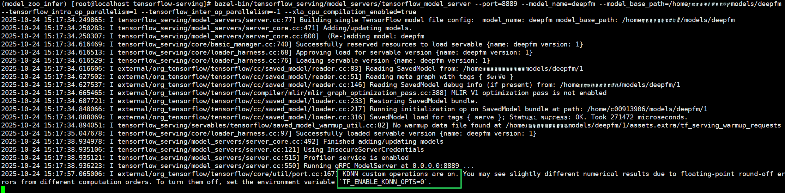

# 快速入门

## 鲲鹏TensorFlow安装

1. 获取TensorFlow开源代码。

   ```bash
   git clone -b v2.15.0 <https://github.com/tensorflow/tensorflow.git> open-tensorflow
   ```

2. 获取鲲鹏TensorFlow优化补丁。

   ```bash
   git clone -b master <https://gitcode.com/BoostKit/tensorflow.git> sra-tensorflow
   ```

3. 使能优化补丁。

   ```bash
   cp sra-tensorflow/0001-boostsra-tensorflow.patch open-tensorflow
   cd open-tensorflow
   patch -p1 < 0001-boostsra-tensorflow.patch
   ```

4. 编译pip包。

   ```bash
   bazel build --config=opt //tensorflow/tools/pip_package:build_pip_package
   ```

5. 编译libtensorflow\_cc.so。

   ```bash
   bazel build --config=opt //tensorflow/libtensorflow_cc.so 
   ```

如果在编译过程中遇到任何问题，可参考以下文档：

[TensorFlow 移植指南](https://www.hikunpeng.com/document/detail/zh/SRA/ecosystemEnable/TensorFlow/kunpengtensorflow_02_0001.html)

[TensorFlow 安装](https://tensorflow.google.cn/install/source?hl=zh-cn)

## 运行样例

使用TF Serving启动推理压测指导请参见《TensorFlow Serving推理部署框架 移植指南》的“[启动服务并压测](https://www.hikunpeng.com/document/detail/zh/SRA/ecosystemEnable/TensorFlowServing/kunpengtfserving_02_0012.html)”章节。

### Tensorflow ANNC图编译优化特性

鲲鹏TensorFlow ANNC图编译优化特性提供了TensorFlow图融合、XLA图融合、算子优化三种优化特性，具体使用说明参见[《API参考》](./api_reference.md)。

1. 执行TensorFlow图融合。

    ```bash
    annc-opt -I /base_model/deepfm/1/ -O /optimized_model/deepfm/1/ lookup_embedding_hash
    cp -r /base_model/deepfm/1/variables /optimized_model/deepfm/1/
    ```

2. 设置环境变量。

    ```bash
    export ENABLE_BISHENG_GRAPH_OPT=""
    export OMP_NUM_THREADS=1
    export TF_XLA_FLAGS="--tf_xla_auto_jit=2 --tf_xla_cpu_global_jit --tf_xla_min_cluster_size=16"
    export XLA_FLAGS="--xla_cpu_enable_xnnpack=true"
    export ANNC_FLAGS="--gemm-opt --graph-opt"
    ```

3. 启动TF Serving服务。

    ```bash
    /path/to/tensorflow-serving/bazel-bin/tensorflow_serving/model_servers/tensorflow_model_server --port=8889 --model_name=deepfm --model_base_path=/optimized_model/deepfm --tensorflow_intra_op_parallelism=1 --tensorflow_inter_op_parallelism=-1 --xla_cpu_compilation_enabled=true
    ```

    > **说明：** 
    >“--model\_base\_path“所指定的模型不在此限制，用户可自行下载或使用其他模型。

4. 启动客户端压测。

    ```bash
    docker run -it --rm --net host  nvcr.io/nvidia/tritonserver:24.05-py3-sdk perf_analyzer --concurrency-range 28:28:1 -p 8561 -f perf.csv -m deepfm --service-kind tfserving -i grpc --request-distribution poisson -b 128  -u localhost:8889 --percentile 99 --input-data=random 
    ```

### TensorFlow Serving线程调度优化特性

鲲鹏TensorFlow Serving线程调度优化特性提供了算子批量调度和线程亲和性隔离两个特性，具体使用说明参见[《API参考》](./api_reference.md)。

### TensorFlow集成KDNN

KDNN是华为提供的基于鲲鹏平台优化的高性能AI算子库，其中MatMul、FusedMatMul、SparseMatMul算子已经适配TensorFlow。集成KDNN（Kunpeng Deep Neural Network Library，鲲鹏DNN库）可以降低NN类算子的时延，大幅增强模型推理性能。

1. 启动服务端。

    ```bash
    numactl -N 0 /path/to/serving/bazel-bin/tensorflow_serving/model_servers/tensorflow_model_server --port=8889 --model_name=deepfm --model_base_path=/path/to/model_zoo/models/deepfm --tensorflow_intra_op_parallelism=1 --tensorflow_inter_op_parallelism=-1 --xla_cpu_compilation_enabled=true
    ```

    > **说明：** 
    >**numactl -N 0**表示将程序绑定到第0个NUMA节点上运行。

2. 启动客户端性能测试。

    ```bash
    docker run -it --rm --cpuset-cpus="$(cat /sys/devices/system/node/node0/cpulist)" --cpuset-mems="0" --net host  nvcr.io/nvidia/tritonserver:24.05-py3-sdk perf_analyzer --concurrency-range 28:28:1 -p 8000 -f perf.csv -m deepfm --service-kind tfserving -i grpc --request-distribution poisson -b 128  -u localhost:8889 --percentile 99 --input-data=random
    ```

    > **说明：** 
    >--cpuset-cpus：设置容器绑定的CPU核编号。
    >--cpuset-mems：设置容器绑定的NUMA内存节点。

    性能测试启动后，服务端打印“KDNN custom operations are on. You may see slightly different numerical results due to floating-point round-off errors from different computation orders. To turn them off, set the environment variable \`TF\_ENABLE\_KDNN\_OPTS=0\`”即表示使能成功。

    KDNN默认使能，可以通过设置环境变量TF\_ENABLE\_KDNN\_OPTS=0关闭KDNN。

    
